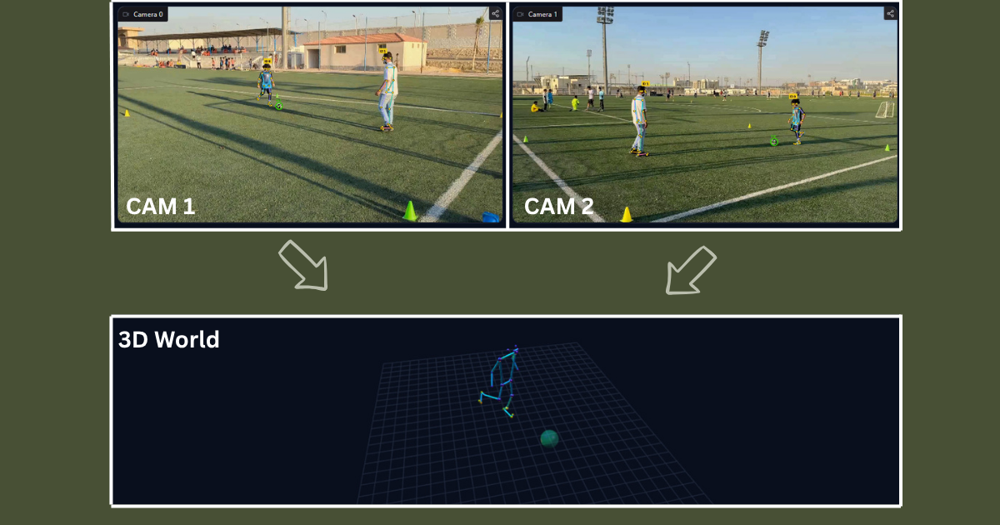
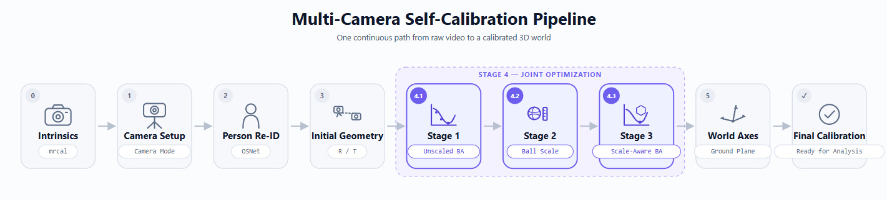

# Multi-Camera Self-Calibration and Metric 3D Reconstruction



This project reconstructs a **metric 3D scene from multiple ordinary, static cameras** while automatically estimating the geometry relating them. Given synchronized footage from two or more cameras, the pipeline in [pipeline.ipynb](pipeline.ipynb) recovers each camera's pose relative to a shared reference frame, resolves the reconstruction's real-world (metric) scale, and defines a consistent 3D world coordinate system anchored to the physical ground — without a checkerboard or calibration wand in the scene.

The current experimental scene involves a football/soccer player and a ball, captured by two static cameras. This is the **observation source**, not the deliverable: the player's body and the ball supply the correspondences and metric reference the calibration math needs. The output is multi-camera calibration + 3D reconstruction infrastructure, meant to sit underneath a separate, downstream analysis layer.

## Live Demo

[Try the live demo on Hugging Face](https://huggingface.co/spaces/abdelkader9090/analysis)

## The Problem

Reconstructing accurate 3D geometry from multiple cameras requires knowing, for every camera:

- **Intrinsics** — focal length, principal point, lens distortion.
- **Extrinsics** — rotation and translation relative to the other cameras.
- **Relative geometry** — one jointly-consistent multi-camera configuration, not independent pairwise estimates.
- **Metric scale** — cameras alone recover geometry only up to an arbitrary scale factor; an object of known physical size is needed to anchor it to real units.
- **A consistent world coordinate system** — an origin and axis convention (e.g. "up" defined by the ground) that downstream 3D analysis can use.

This is traditionally solved with a checkerboard or calibration wand. This project instead estimates extrinsics, metric scale, and the world frame directly from what the cameras already see: a person moving through the shared field of view, and a ball of known size.

## Input and Output

### Input

- **Camera intrinsics** per camera (K matrix + lens distortion), supplied as pre-computed values — see [Stage 0](#stage-0--camera-intrinsics-pre-calibrated-input).
- **Synchronized frames** from each camera, showing a player and, for at least some frames, a visible ball.
- **A known physical reference**: the ball's real radius (`BALL_RADIUS_CM`, default 11.0 cm).

### Output

A single serialized calibration file (`stereo_calibration_hybrid.pkl`) containing, per camera: intrinsics (`Ks`, `dists`), extrinsics relative to camera 1 (`Rs`, `Ts`), essential/fundamental matrices (`Es`, `Fs`), metric scale (`SCALE`, `SCALE_UNIT`), and the world coordinate transform (`WORLD_TRANSFORM`). This is the calibration package a downstream 3D analysis tool would load — it does not perform that analysis itself.

## Pipeline Overview



> The diagram labels the first stage "mrcal." In the current code, intrinsics aren't computed by any calibration routine — they're hardcoded `K`/distortion values (see Stage 0). Whether mrcal produced those numbers upstream isn't something this repository can confirm.

```text
Camera Intrinsics (pre-calibrated input)
        |
Synchronized Multi-Camera Frames
        |
Cross-Camera Correspondences (OSNet Re-ID + Pose)
        |
Initial Extrinsics per camera (Essential/Fundamental matrix, R + unit-direction T)
        |
Stage 4 — Joint Optimization
    Stage 1: Unscaled Bundle Adjustment
    Stage 2: Ball-Based Metric Scale Recovery
    Stage 3: Scale-Aware Bundle Adjustment
        |
Ground Plane / World Coordinate Construction
        |
Validation
        |
Final Calibration Package (stereo_calibration_hybrid.pkl)
```

## Pipeline Stages

### Stage 0 — Camera Intrinsics (pre-calibrated input)

Cell 2 hardcodes two intrinsic profiles as NumPy arrays — `K_cam12`/`dist_cam12` and `K_cam3`/`dist_cam3` — each a 3x3 `K` matrix plus a 5-parameter OpenCV radial-tangential distortion vector (`k1, k2, p1, p2, k3`). A `PATTERN` string assigns one profile per camera slot, so identical camera bodies can share a profile across a rig with more than two cameras. Nothing here *computes* these values — they're treated as already-known input, presumably calibrated upstream by some other tool.

### Stage 1 — Video Preparation

Cell 1/3 configure the camera count (`NUM_CAMS`) and per-camera frame folders, and warn if frame counts differ across cameras — frames are assumed pre-synchronized by order/filename, with no timestamp-based alignment.

### Stage 2 — Cross-Camera Correspondences (OSNet Re-ID + Pose)

For each cam1 <-> camK pair ([scripts/reid_match.py](scripts/reid_match.py), [scripts/match.py](scripts/match.py)): YOLO11 (`models/yolo11x.pt`, COCO class 0) detects people in both views; each crop is embedded with **OSNet** (`osnet_ain_x1_0`, via `torchreid`) using horizontal-flip-averaged embeddings, combined with a torso-color histogram signal into a weighted similarity score, and matched with Hungarian assignment above a confidence threshold. For each matched pair, MediaPipe Pose extracts body keypoints in both crops; the intersection of visible keypoints (shoulders/hips/knees/ankles, landmark IDs `{11,12,23,24,25,26,27,28}`) becomes that frame's 2D correspondence points. An optional review UI lets a bad match be discarded before it reaches calibration.

### Stage 3 — Initial Extrinsic Estimation

For each cam1 <-> camK pair independently (Cell 5): correspondence points are undistorted and normalized, an Essential matrix is estimated with RANSAC (falling back to a Fundamental matrix if weak), and `cv2.recoverPose` yields a rotation `R` and translation **direction** `T` (unit norm — no scale yet). This is an initialization, not a final calibration: each pair is computed independently, so different pairs aren't yet mutually consistent, and the structure still lives in an arbitrary, unscaled frame.

### Stage 4 — Joint Optimization

All non-reference cameras and the reconstructed scene are refined jointly, across three internal stages (Cell 5b):

**Stage 1 — Unscaled Bundle Adjustment.** Every camera's `(R, T-direction)` and every triangulated 3D point are refined jointly in one `scipy.optimize.least_squares` problem, minimizing reprojection error across all cameras at once, with translations still constrained to unit norm. A sparse Jacobian and an outer IRLS loop (3 iterations, approximating a Cauchy robust loss) progressively down-weight outlier correspondences; the iterate with the best true (unweighted) reprojection RMS is kept, not necessarily the last one.

**Stage 2 — Metric Scale Recovery from the Ball.** A YOLO ball detector scans every frame of every camera. For each non-reference camera **separately**, ball detections are gated by symmetric epipolar distance, triangulated, and converted to an estimated real-world diameter from pixel radius and depth; a MAD-based outlier filter discards inconsistent frames. Scale is recovered **per camera, not pooled into one shared factor** — correspondences are pairwise-to-cam1 only, so a single shared scale was found, in testing, to produce roughly 2x real-world measurement errors.

**Stage 3 — Scale-Aware Bundle Adjustment.** A second joint refinement, now in full metric space (3 degrees of freedom per translation, no unit-norm constraint), reusing Stage 1's exact point/observation bookkeeping and adding a per-frame ball-radius residual that anchors the reconstructed ball size to its known radius, preventing scale drift. This is the final refinement of camera geometry and 3D structure — geometrically consistent and metrically meaningful.

### Stage 5 — Ground Plane and World Coordinate System

A separate stage from camera calibration: ball centers near the ground are triangulated and a plane is fit through them by SVD. That plane's normal becomes the world **+Y (up)**; world **+X** comes from projecting the camera's own +X onto the ground plane, and **+Z = X × Y** completes a right-handed frame (labeled "forward" in the code — derived from camera orientation, not any specific field/goal direction). Automated checks guard the fit: a minimum point count, an area-ratio check against near-collinear ball tracks, a relative-RMS planarity threshold, and a leave-one-out normal-stability check. A configurable offset (`GROUND_Y_OFFSET_CM`, default 9 cm) shifts the world origin down to compensate for the ball's center sitting roughly one radius above the true floor. The reference pair's `R`/`T` can optionally be re-refined jointly with the ground-plane fit. A manual, click-based alternative also exists for defining the axis.

## Validation

- **Reprojection error analysis** (Cell 6): per camera-pair mean/max reprojection error in pixels.
- **Stereo rectification** (Cell 7): `cv2.stereoRectify` plus a visual epipolar-line check.
- **Interactive epipolar-line tester** (Cell 11): click a point in one view, see its epipolar line in the other.
- **World-frame verification** (Cell AX2): checks ground points land near `Y = 0` and the recovered Y axis is close to `[0, 1, 0]`.
- **Saved-calibration round-trip validator with 3D skeleton reconstruction** (Cell 12): reloads the saved pickle from disk, re-detects people/pose, matches people across cameras by epipolar consistency, triangulates the matched skeleton, and renders it interactively (Plotly) — the project's intended physical sanity check. **This entire cell is currently commented out** in the notebook and is not executed by the current pipeline run.

## Final Calibration Output

Cell 8 saves `stereo_calibration_hybrid.pkl`, requiring both `USE_WORLD_AXIS` and `USE_SCALE` enabled. It bundles per-camera intrinsics/extrinsics/essential-fundamental matrices, the metric scale, and `WORLD_TRANSFORM`, plus flat `K1/K2/R/T/...` aliases for the cam1<->cam2 pair. The project's scope ends here — **camera calibration and metric 3D reconstruction infrastructure**, ready to be loaded by a separate downstream analysis pipeline.

## Technology Stack

Verified against actual imports in `pipeline.ipynb` and `scripts/`:

- **Python**, **NumPy**, **SciPy** (`least_squares`, sparse Jacobians, Hungarian assignment)
- **OpenCV** (`cv2`) — undistortion, Essential/Fundamental estimation, pose recovery, triangulation, rectification
- **PyTorch** + **torchvision**, **torchreid** (OSNet `osnet_ain_x1_0`)
- **Ultralytics YOLO11** (`models/yolo11x.pt`) — person and ball detection
- **MediaPipe** (`solutions.pose`) — body keypoint estimation
- **Matplotlib** — visualization and interactive click-based tools
- **Pillow**, **Plotly** (Plotly only for the currently disabled Cell 12 viewer)

No dependency manifest (`requirements.txt` / `environment.yml`) is currently committed to the repository.

## Status

Integrating more than two cameras is currently in progress, aimed at giving the most accurate reconstruction results possible.
