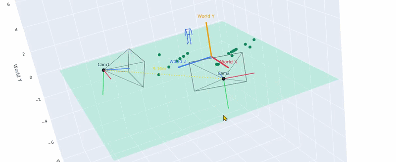
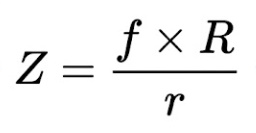

# 3D World


# Multi-Camera Self-Calibration and Metric 3D Reconstruction


This project reconstructs a **metric 3D scene from multiple ordinary, static cameras** while automatically estimating the geometry relating them. Given synchronized footage from two or more cameras, the pipeline in [pipeline.ipynb] recovers each camera's pose relative to a shared reference frame, resolves the reconstruction's real-world (metric) scale, and defines a consistent 3D world coordinate system anchored to the physical ground — without a checkerboard or calibration wand in the scene.

The current experimental scene involves a football/soccer player and a ball, captured by two static cameras. This is the **observation source**, not the deliverable: the player's body and the ball supply the correspondences and metric reference the calibration math needs. The output is multi-camera calibration + 3D reconstruction infrastructure, meant to sit underneath a separate, downstream analysis layer.

### 🤗 Live Demo

[](https://huggingface.co/spaces/abdelkader9090/analysis)

## The Problem

Reconstructing accurate 3D geometry from multiple cameras requires knowing, for every camera:

- **Intrinsics** — focal length, principal point, lens distortion 
- **Extrinsics** — rotation and translation relative to the other cameras.
- **Relative geometry** — one jointly-consistent multi-camera configuration, not independent pairwise estimates.
- **Metric scale** — cameras alone recover geometry only up to an arbitrary scale factor; an object of known physical size is needed to anchor it to real units.
- **A consistent world coordinate system** — an origin and axis convention (e.g. "up" defined by the ground) that downstream 3D analysis can use.

This is traditionally solved with a checkerboard or calibration wand. This project instead estimates extrinsics, metric scale, and the world frame directly from what the cameras already see: a person moving through the shared field of view, and a ball of known size.

## Input and Output

### Input

- **Camera intrinsics** per camera (K matrix + lens distortion), supplied as pre-computed values (offline separated process with mrcal)— see [Stage 0](#stage-0--camera-intrinsics-pre-calibrated-input).
- **Synchronized frames** from each camera, showing a player and, for at least some frames, a visible ball.
- **A ball** with known radius (default 11.0 cm).

### Output

A single serialized calibration file (`stereo_calibration_hybrid.pkl`) containing, per camera: intrinsics (`Ks`, `dists`), extrinsics relative to camera 1 (`Rs`, `Ts`), essential/fundamental matrices (`Es`, `Fs`), metric scale (`SCALE`, `SCALE_UNIT`), and the world coordinate transform (`WORLD_TRANSFORM`). This is the calibration package a downstream 3D analysis tool would load — it does not perform that analysis itself.

## Pipeline Overview


> hint Some cameras have factory-provided intrinsic parameters and do not require intrinsic  recomputing.

```text
Camera Intrinsics (pre-calibrated input)
        |
Synchronized Multi-Camera Frames
        |
Cross-Camera Correspondences (OSNet Re-ID + Pose)
        |
Initial Extrinsics per camera (Essential/Fundamental matrix, R + unit-direction T)
        |
Stage 4 — Joint Optimization
    Stage 1: Unscaled Bundle Adjustment
    Stage 2: Ball-Based Metric Scale Recovery
    Stage 3: Scale-Aware Bundle Adjustment
        |
Ground Plane / World Coordinate Construction
        |
Validation
        |
Final Calibration Package (stereo_calibration_hybrid.pkl)
```

## Pipeline Stages

### Stage 0 — Camera Intrinsics (pre-calibrated input)


For each camera, the intrinsic parameters are either obtained from a previous calibration process or provided directly by the camera manufacturer.
### Stage 1 — Video Preparation

Select the multi-camera MODE & Data used for extrinsic calibration. The observations are collected from multiple locations across the analysis area, aiming not only for a large number of observations but also for an optimal spatial distribution that provides reliable camera geometry.

### Stage 2 — Cross-Camera Correspondences (OSNet Re-ID + Pose)

For each cam1 <-> camK pair ([scripts/reid_match.py], [scripts/match.py]): YOLO11 (`models/yolo11x.pt`, COCO class 0) detects people in both views; each crop is embedded with **OSNet** (`osnet_ain_x1_0`, via `torchreid`) using horizontal-flip-averaged embeddings, combined with a torso-color histogram signal into a weighted similarity score, and matched with Hungarian assignment above a confidence threshold. For each matched pair, MediaPipe Pose extracts body keypoints in both crops; the intersection of visible keypoints (shoulders/hips/knees/ankles, landmark IDs `{11,12,23,24,25,26,27,28}`) becomes that frame's 2D correspondence points. An optional review UI lets a bad match be discarded before it reaches calibration.

### Stage 3 — Initial Extrinsic Estimation

For each cam1 <-> camK pair independently : correspondence points are undistorted and normalized, an Essential matrix is estimated with RANSAC (falling back to a Fundamental matrix if weak), and `cv2.recoverPose` yields a rotation `R` and translation **direction** `T` (unit norm — no scale yet). This is an initialization, not a final calibration: each pair is computed independently, so different pairs aren't yet mutually consistent, and the structure still lives in an arbitrary, unscaled frame.

### Stage 4 — Joint Optimization

All non-reference cameras and the reconstructed scene are refined jointly, across three internal stages :

**Stage 1 — Unscaled Bundle Adjustment.** Every camera's `(R, T-direction)` and every triangulated 3D point are refined jointly in one `scipy.optimize.least_squares` problem, minimizing reprojection error across all cameras at once, with translations still constrained to unit norm. A sparse Jacobian and an outer IRLS loop (3 iterations, approximating a Cauchy robust loss) progressively down-weight outlier correspondences

**Stage 2 — Metric Scale Recovery from the Ball.** 




A YOLO ball detector scans every frame of every camera. For each non-reference camera separately, ball detections are gated using symmetric epipolar distance, triangulated, and used to estimate the ball's metric diameter from its pixel radius and depth. A MAD-based outlier filter removes inconsistent observations. Scale is recovered independently for each camera rather than pooled into a single shared factor, using pairwise correspondences with the reference camera (cam1).

**Stage 3 — Scale-Aware Bundle Adjustment.** A second joint refinement, now in full metric space (3 degrees of freedom per translation, no unit-norm constraint), reusing Stage 1's exact point/observation bookkeeping and adding a per-frame ball-radius residual that anchors the reconstructed ball size to its known radius, preventing scale drift. This is the final refinement of camera geometry and 3D structure — geometrically consistent and metrically meaningful.

### Stage 5 — Ground Plane and World Coordinate System
Ball centers near the ground are triangulated and used to fit the ground plane using SVD. The plane normal defines the world +Y (up), while +X is derived from the reference camera orientation and projected onto the ground plane, with +Z = X × Y completing the right-handed coordinate system. Automated geometric checks validate the plane fit, and an optional ground offset compensates for the ball center being above the floor. A manual click-based alternative is also available for defining the world axes.

## Validation

- **Reprojection error analysis** (Cell 6): per camera-pair mean/max reprojection error in pixels.
- **Stereo rectification** (Cell 7): `cv2.stereoRectify` plus a visual epipolar-line check.
- **Interactive epipolar-line tester** (Cell 11): click a point in one view, see its epipolar line in the other.
- **World-frame verification** (Cell AX2): checks ground points land near `Y = 0` and the recovered Y axis is close to `[0, 1, 0]`.

## Final Calibration Output

The system exports a calibration file containing the cameras' intrinsic and extrinsic parameters, metric scale, and world coordinate transformation. The output is ready to be integrated into a separate downstream 3D analysis pipeline.

## Technology Stack

Verified against actual imports in `pipeline.ipynb` and `scripts/`:

- **Python**, **NumPy**, **SciPy** (`least_squares`, sparse Jacobians, Hungarian assignment)
- **OpenCV** (`cv2`) — undistortion, Essential/Fundamental estimation, pose recovery, triangulation, rectification
- **PyTorch** + **torchvision**, **torchreid** (OSNet `osnet_ain_x1_0`)
- **Ultralytics YOLO11** (`models/yolo11x.pt`) — person and ball detection
- **MediaPipe** (`solutions.pose`) — body keypoint estimation
- **Matplotlib** — visualization and interactive click-based tools
- **Pillow**, **Plotly** (Plotly only for the currently disabled Cell 12 viewer)


## Feature Work

Improving multi-camera support beyond two cameras to increase reconstruction accuracy and geometric consistency.

Contributions and collaboration are welcome.
